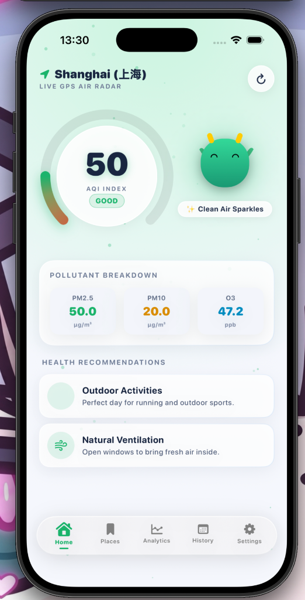
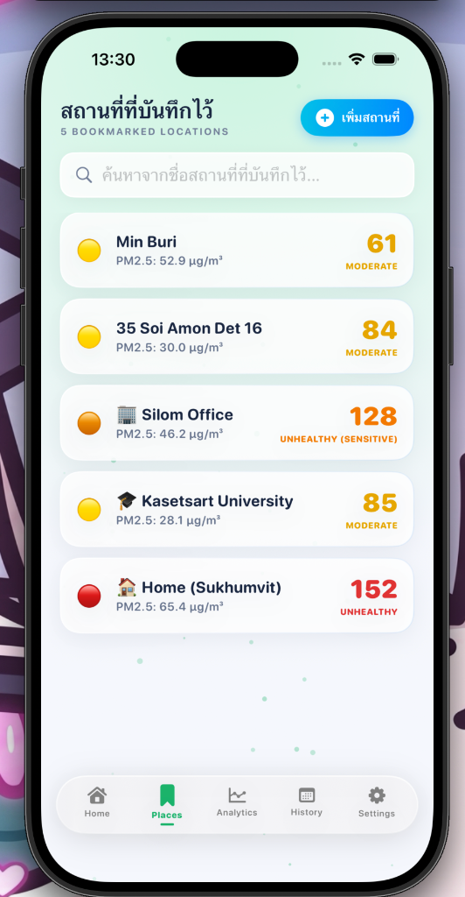
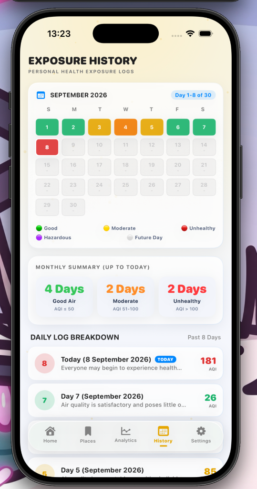
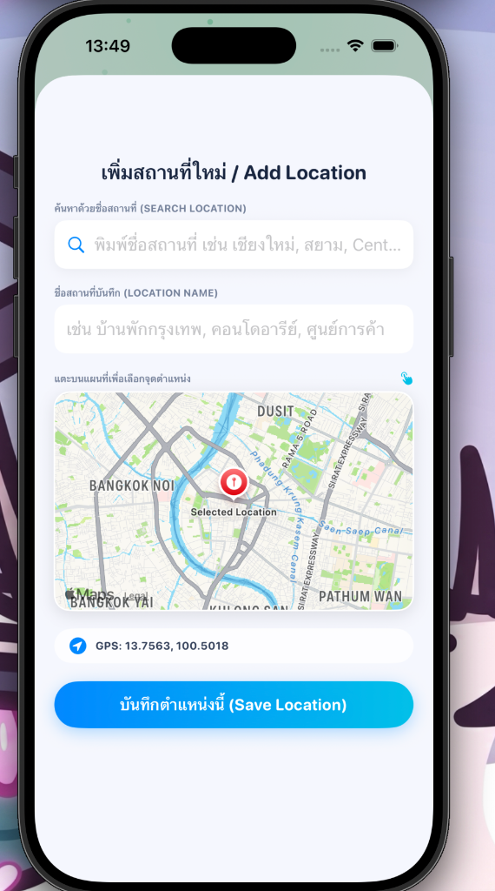

# 🍃 AirSense — Personal Health & Air Quality Tracking App

AirSense is a modern, iOS application designed to monitor real-time Air Quality Index (AQI), PM2.5 pollution levels, personal health exposure logs, and interactive air quality analytics. Powered by **SwiftUI**, **SwiftData**, **CoreLocation**, **MapKit**, and the **World Air Quality Index (WAQI) REST API**, AirSense provides actionable health advice accompanied by an interactive **Air Dragon Mascot** that dynamically adapts its expression and safety gear based on air pollution severity.

---

## 👥 Team Members

1. **6610308** Thanadon Ruangpakdee
2. **6610936** Thanakrit Kodklangdon
3. **6610387** Kitirat Pisithaporn

---

## 📱 App Overview & Screenshots

| Live GPS Radar Dashboard | Saved Places & Map Radar |
| :---: | :---: |
|  |  |

| Exposure Heatmap Calendar | Add Location & Live Search |
| :---: | :---: |
|  |  |

---

## ✨ Key Features

1. **🛰️ Live GPS Air Quality Radar**
   - Fetches live AQI, PM2.5, PM10, O3, NO2, SO2, and CO metrics using location GPS coordinates via WAQI REST API.
   - Intelligent offline resilience with automatic SwiftData local caching.

2. **🐉 Interactive Air Dragon Mascot**
   - Reactive mascot that changes facial expressions, mood animations, and protective gear (e.g., N95 masks, dual-filter respirators) matching air pollution severity.

3. **📍 Bookmarked Places & Live Search**
   - Save favorite locations (Home, Office, University).
   - Live location autocomplete search powered by `MKLocalSearchCompleter` and interactive `MapKit` pin placement (`MapReader`).

4. **📊 Location Analytics & Comparative Charts**
   - Detailed AQI trends, pollutant breakdown statistics, and historical comparative data visualization.

5. **🗓️ Exposure History & Heatmap Log**
   - Monthly calendar heatmap tracking daily personal exposure levels.
   - Clean color-coded day tiles, severity legend, and PDF/CSV report export option.

6. **🌐 Bilingual & Modern Glassmorphism UI**
   - Dynamic **Thai 🇹🇭 / English 🇺🇸** language switching (`@AppStorage`).
   - Custom **Light Mode / Dark Mode** theme toggle.
   - Glassmorphic UI aesthetics featuring particle background effects.

---

## 🛠️ Tech Stack & Requirements

- **Language:** Swift 5.9+
- **Frameworks:** SwiftUI, SwiftData, CoreLocation, MapKit, Combine
- **API:** World Air Quality Index (WAQI) REST API
- **Minimum OS:** iOS 17.0+
- **IDE:** Xcode 15.0+

---

## 🚀 How to Run the Project

1. Clone the repository:
   ```bash
   git clone https://github.com/Thanadon-Ruangpakdee/AirSense.git
   cd AirSense
   ```
2. Open the project in Xcode:
   ```bash
   open AirSense.xcodeproj
   ```
3. Select an iOS Simulator (e.g., iPhone 15 Pro) or a connected iOS device running iOS 17.0+.
4. Press `Cmd + R` to build and run the application.

---

© 2026 AirSense Team. Built for iOS Development Project.
